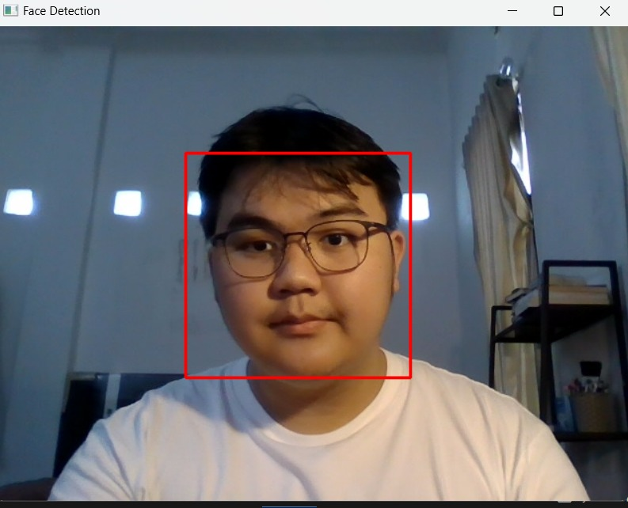

# Face Detection Project


This is the main program for face detection using OpenCV Python. Follow the instructions below to set up your environment and run the project.

## Prerequisites

Make sure you have the following installed:
- Python 3.x
- `pip` (Python package manager)

## Installation
### 1. Clone the Repository
```bash
git clone https://github.com/your-username/face-detection.git
cd face-detection
```

### 2. Install and Activate a Virtual Environment
Check the venv installation and Activation documentation [here](https://packaging.python.org/en/latest/guides/installing-using-pip-and-virtual-environments/)

### 3. Install the openCV
```bash
py -m pip install opencv-python
```


